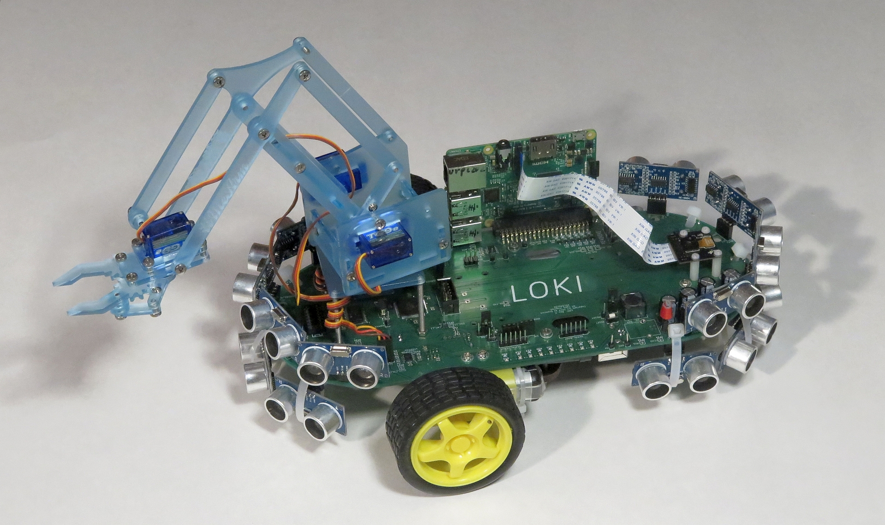

# bus_loki

This repository contains the documentation and code for the
Loki robot.

<BlockQuote>

</BlockQuote>

## Introduction

Loki is a small robot that is intended to be a used to learn
how to use ROS (Robot Operating System.)  ROS runs on a
Raspberry Pi 2 computer board and it plugs into the Loki
printed circuit board to access 2 motors with drive electronics
and wheel encoders, 16 sonars, a 5 mega pixel camera,
a 4 degree of freedom Arm, and a 6000mAH battery.
Using a USB Wireless dongle, software is developed on a
laptop/desktop system and downloaded into the Raspberry Pi 2
processor board.

## Specifications:

* Runs ROS (Robot Operating System) on a Raspberry Pi 2 computer.

* Dimensions: 250mm (L) x 110mm (W) x ~200mm (H)

* Battery: 6000mAH Lithium-Ion Battery Pack

* Sonars: 16 HC-SR04 sonars

* Motors: 2 Micro Metal Gearmotors 298:1 Gear Redution

* Wheels: 70mm (D) x 8mm (W)

* Encoders: 16.26 ticks/mm

* Speed: 1 M/Sec

* Embedded Processor: 20MHz @ 5V Atmel ATmega2560 (Arduino Mega compatible)

* Arm: 4 degree of freedom Me Arm 0.4 

* LED's: 8 

* Expansion: 2x5 .1in Expansion Bus Connector

* Camera: Upward pointing Raspberry Pi Camera (2592 x 1944 pixels)

## Running Loki

(These instructions are too brief!!!)

Do the following: (The first setup step is a turse set of reminders and not detailed)

1. Initial setup includes booting the RasPi2 and the source ./devel/setup.bash done.
   Have the my_arduino_params.yaml file copied over from my_arduino_params.yaml.loki
   Run 'sudo mgetty -s 115200 /dev/ttyAMA0' on the RaspPi2 to setup serial port
   To run fiducial localization you need a calibrated camera 'yaml' file
   and the size of your fiducials needs to be setup in a fiducial launch file.
   Properly configure ROS_MASTER_URI on the RaspPi as well as laptop to run 'rviz'.
   (This is a bit involved and we may add to this section later as needed)

2. Hit the reset switch on the Loki near the green leds and then
   Run `roslaunch ros_arduino_python arduino.launch` on RasPi2
   You must not see any errors that stop the launch.

3. For joystick control you need either the PS2 or XBox usb dongle pluged 
   into the RasPi2.   You will have to plug it into USB then pair as follows:

   XBox:  Press tiny reset button in back if you have not paired before.
   If you have paired before press big chrome X button.

   PS3: Set the slide switch on the USB dongle to Xinput to emulate XBox protocol.
   Plug it in and on hand controller press the 'P3' button in center down till
   only one of the 4 leds is on then you are paired and dongle led is solid red.

   After pairing run  'roslaunch joy_input joystick.launch' 

   Once joystick node is running hold down the button on front of left side of controller
   while then using left joystick to control velocity.   You should get /cmd_vel
   commands to the robot but have to keep moving joystick or the bot times out in 2 sec.

4. For Fiducial maps:   Run 'roslaunch fiducial_slam fiducial_raspi_3d.launch` on RasPi2
   (mjstn - Is this True????:   Run `roslaunch fiducial_lib loki.launch` on laptop)
   (For details refer to:  https://github.com/UbiquityRobotics/fiducials README.md)

5. Run `rviz` on laptop.

   * In left sidebar, under `Global Option` change `Fixed Frame
     to `base_link`.

   * Click on [Add] and select `Range`.  You will need to do this
     16 times, because there are 16 sonars. 

   * Under `Range`=>`Topic`, select the correct topic to listen to.
     This will be one of `/arduino/sensor/sensor_1` through 
     `/arduino/sensor/sensor_16`.

   * Rinse, Lather, Repeat.

## Installing the Arduino-Makefile Development Environment

The software environment for the bus_loki is more complicated
than we would like.  The bus_loki deliberately uses an ATmega2560
microcontroller to be as compatible as possible with the Arduino
community.

For a variety of reasons, the code is spread across multiple
repositories.  Furthermore, some of these other repositories
have other dependencies that are annoying (e.g. the
`bus_raspberry_pi` depends upon ATmega324P support, which
is not readily available.)  To be consistent across all
of these repositories, requires more effort.  In addition,
the Arduino-IDE does not play nice with version control systems.
So, we use a fairly popular alternative called `Arduino-Makefile`
which uses fairly standard Makefiles and standalone editors
(e.g. `vim` or `emacs`) to develop Arduino code that is
complatible with the Arduino IDE.

To set things up:

        cd .../catkin_ws/src
        git clone https://github.com/UbiquityRobotics/Arduino-Makefile.git
        git clone https://github.com/UbiquityRobotics/bus_common.git
        git clone https://github.com/UbiquityRobotics/bus_loki.git
        git clone https://github.com/UbiquityRobotics/bus_server.git
        git clone https://github.com/UbiquityRobotics/bus_slave.git
        # The following command downloads ~2GB of git version control stuff.
        # Even with a fast link it takes a while...
        git clone https://github.com/UbiquityRobotics/Arduino.git

Next, we need to bring over all the compilers and stuff to support
the AVR compilation environment:

        sudo apt-get avr-libc avrdude binutils-avr gcc-avr
        # We also need GNU make:
        sudo apt-get install build-essential

## Installing the Bootloader

The bootloader is installed onto Loki using the Arduino IDE.

For Loki Rev. C, the 2x3 ISP header N26 does not properly connect
to RESET.  The work around is to use patch cables to connect the
programmer header to various test points on Loki.  The table below
shows the six connections:

<BlockQuote>
<Table Border="1">
<TR> <TH>Signal</TH> <TH>Programmer</TH> <TH>Loki</TH> </TR>
<TR> <TD>MISO</TD>   <TD>Pin 1</TD>      <TD>TP8</TD>  </TR>
<TR> <TD>VREF</TD>   <TD>Pin 2</TD>      <TD>TP31</TD> </TR>
<TR> <TD>SCK</TD>    <TD>Pin 3</TD>      <TD>TP10</TD> </TR>
<TR> <TD>MOSI</TD>   <TD>Pin 4</TD>      <TD>TP9</TD>  </TR>
<TR> <TD>RESET</TD>  <TD>Pin 5</TD>      <TD>TP5</TD>  </TR>
<TR> <TD>GND</TD>    <TD>Pin 6</TD>      <TD>TP32</TD> </TR>
</Table>
</BlockQuote>

Perform the following steps:

1. Make sure you have the Arduino IDE installed:

        sudo apt-get install arduino

2. Start the Arduino IDE.  (You may need to run it as `sudo arduino`
   in order to give `avrdude` access to the USB device.)

3. Using the [Tools] pull down menu,
   select [Board] => [Arduino Mega 2560 or Mega ADK]

4. Using the [Programmer] pull down menu, select the appropriate
   programmer.

5. Connect the programmer 2x3 connector to the Loki test pins as
   shown in the table above for Loki Rev. C.  For Rev. D and on,
   just connect to the 2x3 ISP connector N26.

6. Connect your programmer to your laptop/desktop.

7. Using the [Tools] pull down menu, select [Burn Bootloader].

That should do it.

When all of the dust settles, you should be able to do the following:

        cd .../catkin_ws/src/bus_loki
        make
        make upload       # Read below for more about uploading

(Random comment: Make sure that C10 is installed.)

## Compiling the Firmware

The actual code that implements the firmware starts in
`bus_loki.ino`.  The key line is:

        #define TEST TEST_...

The values for `TEST_...` are found in `../bus_server/bus_server.h`:

* `TEST_BUS_OUTPUT` outputs a stream of chacters on the serial port.
* `TEST_BUS_ECHO` is a strange bus debugging mode (too hard to explain.)
* `TEST_BUS_COMMAND` blinks an LED on the motor controller board.
* `TEST_BUS_BRIDGE` runs the software as a bus bridge.
* `TEST_BUS_LINE` runs the ROS Arduino Bridge protocol.

To compile the code, type:

        make

## Uploading the Firmware.

The `make` upload target expects you to have USB-serial cable
plugged into your laptop/desktop.  We use the DFRobot FTDI
Basic Breakout board.  This board has two features that we like:

* One you can select between 3.3V and 5V.  We always use 3.3V.
  Ground is pin 1 and plugs into pin 1 of N4 on the bus_loki.

* It puts DTR on pin 6 instead of RTS.  The DTR signal is
  what the Arduinos use for their reset signal.

The DFRobot board requires a USB-A to mini-USB-B cable.  We purchased
ours from Jameco (part number: 2152243.)

To upload the firmware, do the following:

1. Plug the serial download cable into your laptop/desktop.

2. Plug the serial download cable to into N4 on the bus_loki.
   Make sure the GND is connected to pin 1 (which is labeled
   on the Loki board.)

3. Type the following:

        make upload

That should do it.

## Rev. C Pin Mappings

<BlockQuote>
  <Table Border="1">
    <TR>
      <TH>Port</TH>	<TH>Pin</TH>	<TH>Use</TH>		<TH>Arduino</TH>
    </TR><TR>
      <TD>PE0</TD>	<TD>2</TD>	<TD>UART0_RXD</TD>	<TD>0</TD>
    </TR><TR>
      <TD>PE1</TD>	<TD>3</TD>	<TD>UART0_TXD</TD>	<TD>1</TD>
    </TR><TR>
      <TD>PE3</TD>	<TD>5</TD>	<TD>MOTOR2_INPUT1</TD>	<TD>5</TD>
    </TR><TR>
      <TD>PE4</TD>	<TD>6</TD>	<TD>MOTOR2_ENABLE</TD>	<TD>2</TD>
    </TR><TR>
      <TD>PE5</TD>	<TD>7</TD>	<TD>MOTOR2_INPUT2</TD>	<TD>3</TD>
    </TR><TR>
      <TD>PH3</TD>	<TD>15</TD>	<TD>SERVO1</TD>		<TD>6</TD>
    </TR><TR>
      <TD>PH4</TD>	<TD>16</TD>	<TD>SERVO2</TD>		<TD>7</TD>
    </TR><TR>
      <TD>PH5</TD>	<TD>17</TD>	<TD>SERVO3</TD>		<TD>8</TD>
    </TR><TR>
      <TD>PH6</TD>	<TD>18</TD>	<TD>SERVO4</TD>		<TD>9</TD>
    </TR><TR>
      <TD>PB1</TD>	<TD>20</TD>	<TD>SCK</TD>		<TD>52</TD>
    </TR><TR>
      <TD>PB2</TD>	<TD>21</TD>	<TD>MOSI</TD>		<TD>51</TD>
    </TR><TR>
      <TD>PB3</TD>	<TD>22</TD>	<TD>MISO</TD>		<TD>50</TD>
    </TR><TR>
      <TD>PB4</TD>	<TD>23</TD>	<TD>ENCODER_R1</TD>	<TD>10</TD>
    </TR><TR>
      <TD>PB5</TD>	<TD>24</TD>	<TD>ENCODER_R2</TD>	<TD>11</TD>
    </TR><TR>
      <TD>PB6</TD>	<TD>25</TD>	<TD>ENCODER_L1</TD>	<TD>12</TD>
    </TR><TR>
      <TD>PB7</TD>	<TD>26</TD>	<TD>ENCODER_L2</TD>	<TD>13</TD>
    </TR><TR>
      <TD>PL0</TD>	<TD>35</TD>	<TD>S_TRIG14</TD>	<TD>49</TD>
    </TR><TR>
      <TD>PL1</TD>	<TD>36</TD>	<TD>S_TRIG13</TD>	<TD>48</TD>
    </TR><TR>
      <TD>PL2</TD>	<TD>37</TD>	<TD>S_TRIG12</TD>	<TD>47</TD>
    </TR><TR>
      <TD>PL3</TD>	<TD>38</TD>	<TD>S_TRIG11</TD>	<TD>46</TD>
    </TR><TR>
      <TD>PL4</TD>	<TD>41</TD>	<TD>MOTOR1_INPUT1</TD>	<TD>43</TD>
    </TR><TR>
      <TD>PL5</TD>	<TD>40</TD>	<TD>MOTOR1_INPUT2</TD>	<TD>44</TD>
    </TR><TR>
      <TD>PL6</TD>	<TD>39</TD>	<TD>MOTOR1_ENABLE</TD>	<TD>45</TD>
    </TR><TR>
      <TD>PD0</TD>	<TD>43</TD>	<TD>SCL</TD>		<TD>21</TD>
    </TR><TR>
      <TD>PD1</TD>	<TD>44</TD>	<TD>SDA</TD>		<TD>20</TD>
    </TR><TR>
      <TD>PD2</TD>	<TD>45</TD>	<TD>UART1_RXD</TD>	<TD>19</TD>
    </TR><TR>
      <TD>PD3</TD>	<TD>46</TD>	<TD>UART1_TXD</TD>	<TD>18</TD>
    </TR><TR>
      <TD>PG4</TD>	<TD>29</TD>	<TD>S_TRIG15</TD>	<TD>-</TD>
    </TR><TR>
      <TD>PG3</TD>	<TD>28</TD>	<TD>S_TRIG16</TD>	<TD>-</TD>
    </TR><TR>
      <TD>PG2</TD>	<TD>70</TD>	<TD>S_TRIG1</TD>	<TD>39</TD>
    </TR><TR>
      <TD>PG1</TD>	<TD>52</TD>	<TD>BUS_STANDBY</TD>	<TD>40</TD>
    </TR><TR>
      <TD>PK0</TD>	<TD>89</TD>	<TD>S_ECHO8</TD>	<TD>A8</TD>
    </TR><TR>
      <TD>PK1</TD>	<TD>88</TD>	<TD>S_ECHO7</TD>	<TD>A9</TD>
    </TR><TR>
      <TD>PK2</TD>	<TD>87</TD>	<TD>S_ECHO6</TD>	<TD>A10</TD>
    </TR><TR>
      <TD>PK3</TD>	<TD>86</TD>	<TD>S_ECHO5</TD>	<TD>A11</TD>
    </TR><TR>
      <TD>PK4</TD>	<TD>85</TD>	<TD>S_ECHO4</TD>	<TD>A12</TD>
    </TR><TR>
      <TD>PK5</TD>	<TD>84</TD>	<TD>S_ECHO3</TD>	<TD>A13</TD>
    </TR><TR>
      <TD>PK6</TD>	<TD>83</TD>	<TD>S_ECHO2</TD>	<TD>A14</TD>
    </TR><TR>
      <TD>PK7</TD>	<TD>82</TD>	<TD>S_ECHO1</TD>	<TD>A15</TD>
    </TR><TR>
      <TD>PA0</TD>	<TD>78</TD>	<TD>S_TRIG2</TD>	<TD>22</TD>
    </TR><TR>
      <TD>PA1</TD>	<TD>77</TD>	<TD>S_TRIG3</TD>	<TD>23</TD>
    </TR><TR>
      <TD>PA2</TD>	<TD>76</TD>	<TD>S_TRIG4</TD>	<TD>24</TD>
    </TR><TR>
      <TD>PA3</TD>	<TD>75</TD>	<TD>S_TRIG5</TD>	<TD>25</TD>
    </TR><TR>
      <TD>PA4</TD>	<TD>74</TD>	<TD>S_TRIG6</TD>	<TD>26</TD>
    </TR><TR>
      <TD>PA5</TD>	<TD>73</TD>	<TD>S_TRIG7</TD>	<TD>27</TD>
    </TR><TR>
      <TD>PA6</TD>	<TD>72</TD>	<TD>S_TRIG8</TD>	<TD>28</TD>
    </TR><TR>
      <TD>PA7</TD>	<TD>71</TD>	<TD>S_TRIG9</TD>	<TD>29</TD>
    </TR><TR>
      <TD>PJ7</TD>	<TD>79</TD>	<TD>S_TRIG10</TD>	<TD>-</TD>
    </TR><TR>
      <TD>PJ6</TD>	<TD>69</TD>	<TD>S_ECHO9</TD>	<TD>-</TD>
    </TR><TR>
      <TD>PJ5</TD>	<TD>68</TD>	<TD>S_ECHO10</TD>	<TD>-</TD>
    </TR><TR>
      <TD>PJ4</TD>	<TD>67</TD>	<TD>S_ECHO11</TD>	<TD>-</TD>
    </TR><TR>
      <TD>PJ3</TD>	<TD>67</TD>	<TD>S_ECHO12</TD>	<TD>-</TD>
    </TR><TR>
      <TD>PJ2</TD>	<TD>65</TD>	<TD>S_ECHO13_14</TD>	<TD>-</TD>
    </TR><TR>
      <TD>PJ1</TD>	<TD>64</TD>	<TD>S_ECHO15_16</TD>	<TD>14</TD>
    </TR><TR>
      <TD>PC7</TD>	<TD>60</TD>	<TD>LED8</TD>	<TD>30</TD>
    </TR><TR>
      <TD>PC6</TD>	<TD>59</TD>	<TD>LED7</TD>	<TD>31</TD>
    </TR><TR>
      <TD>PC5</TD>	<TD>58</TD>	<TD>LED6</TD>	<TD>32</TD>
    </TR><TR>
      <TD>PC4</TD>	<TD>57</TD>	<TD>LED5</TD>	<TD>33</TD>
    </TR><TR>
      <TD>PC3</TD>	<TD>56</TD>	<TD>LED4</TD>	<TD>34</TD>
    </TR><TR>
      <TD>PC2</TD>	<TD>55</TD>	<TD>LED3</TD>	<TD>35</TD>
    </TR><TR>
      <TD>PC1</TD>	<TD>54</TD>	<TD>LED2</TD>	<TD>36</TD>
    </TR><TR>
      <TD>PC0</TD>	<TD>53</TD>	<TD>LED1</TD>	<TD>37</TD>
    </TR><TR>
    </TR><TR>
    </TR>
  </Table>
</BlockQuote>

<BlockQuote>
  <Table Border="1">
    <TR>
      <TH>Ref</TH>
      <TH>Angle</TH>
      <TH>S_TRIGx<TH>
      <TH>S_ECHOx</TH>
      <TH>IC TRIG</TH>
      <TH>IC ECHO</TH>
      <TH>ARD TRIG</TH>
      <TH>ARD ECHO</TH>
    </TR><TR>
      <TD>N5</TD>
      <TD>0.0</TD>
      <TD>5</TD>
      <TD>5</TD>
      <TD>75</TD>
      <TD>86</TD>o
      <TD>25</TD>
      <TD>A11</TD>
    </TR><TR>
      <TD>N6</TD>
      <TD>22.5</TD>
      <TD>6</TD>
      <TD>6</TD>
      <TD>74</TD>
      <TD>87</TD>
      <TD>26</TD>
      <TD>A10</TD>
    </TR><TR>
      <TD>N7</TD>
      <TD>45.0</TD>
      <TD>7</TD>
      <TD>7</TD>
      <TD>73</TD>
      <TD>88</TD>
      <TD>27</TD>
      <TD>A9</TD>
    </TR><TR>
      <TD>N7</TD>
      <TD>67.5</TD>
      <TD>8</TD>
      <TD>8</TD>
      <TD>72</TD>
      <TD>89</TD>
      <TD>28</TD>
      <TD>A8</TD>
    </TR><TR>
    </TR><TR>
    </TR><TR>
    </TR><TR>
    </TR>
  </Table>
</BlockQuote>
